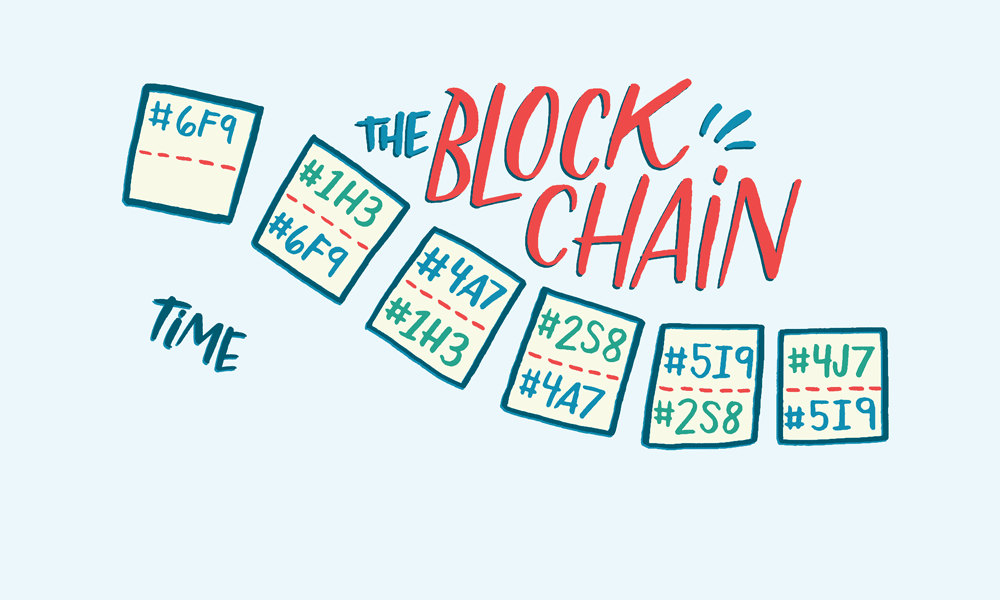

# Mockchain

This is yet another Blockchain implementation 🧱⛓. If you are not familiar with how Blockchain works, this GIF is really helpful:

If this didn't help, then quite frankly, I don't know what will.

This system is completely implemented in Go, and the communication is done using TCP sockets.

We measure the system's transaction throughput and block time, on 5-node and 10-node setups.

The project was deployed on ~okeanos-knossos, an IaaS platform provided by GRNET.

Each node can be set up by executing the `main.go` file, with the appropriate parameters. Usage can be found in the `main.go` file itself.

**Caution:** Do NOT use this system as a cryptocurrency solution. However, if you do, please let us know!
